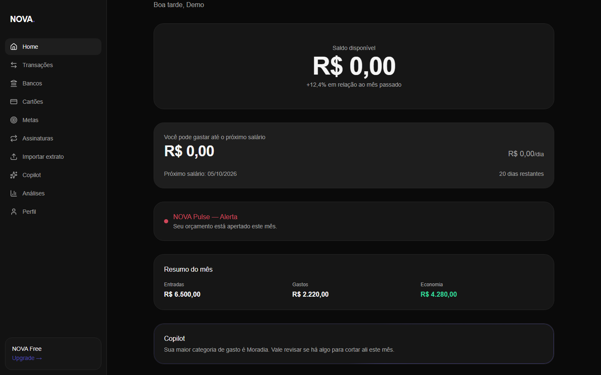

# NOVA

Seu dinheiro. Sob seu controle.

[](https://github.com/paulahaas/nova-finance-app/actions/workflows/ci.yml)
[](LICENSE)

App de finanças pessoais só pra mim: contas, cartões, metas, orçamento e um assistente (Copilot). React + Vite no front, Firebase (login + Firestore) e uma API Express que roda como função da Vercel.



## Rodar

```bash
npm install
cp .env.example .env   # chaves do Firebase e da API do Claude
npm run server         # API local em :8787
npm run dev            # site em :5173 (o Vite manda /api pro servidor)
```

Sem as chaves do Firebase não há login nem dados. Em produção (Vercel) o `api/index.js` serve o mesmo app Express de `server/app.js`.

## O que tem

Dashboard, bancos/contas/cartões, transações, metas (com foto), assinaturas recorrentes, "posso comprar?", Copilot, insights, relatórios e previsão. Instalável no celular (PWA) e com nav própria no mobile.

Importação de extrato (CSV/OFX) categoriza sozinha o que reconhece por regra, usa um classificador próprio (TF-IDF, sem serviço externo) pro resto, aprende com as correções, detecta duplicata e assinatura recorrente antes de confirmar qualquer coisa. Exportação em CSV/Excel e JSON em Configurações.

## Segurança

App de um usuário só: não existe cadastro, e o `firestore.rules` e a API aceitam apenas o UID do dono (`src/config/owner.js`). Cartão guarda só os últimos 4 dígitos e a validade — número completo e CVV nunca são pedidos.

## Estrutura

`src/pages` por área, `src/contexts` (auth e dados no Firestore), `src/services` (cálculos e importação), `server/` (API: importação de extrato, Copilot, Open Finance).

## Testes

```bash
npm run test
```

Cobre a parte que mais importa acertar sozinha: parser de CSV/OFX, categorização, detecção de duplicata e de recorrência.
